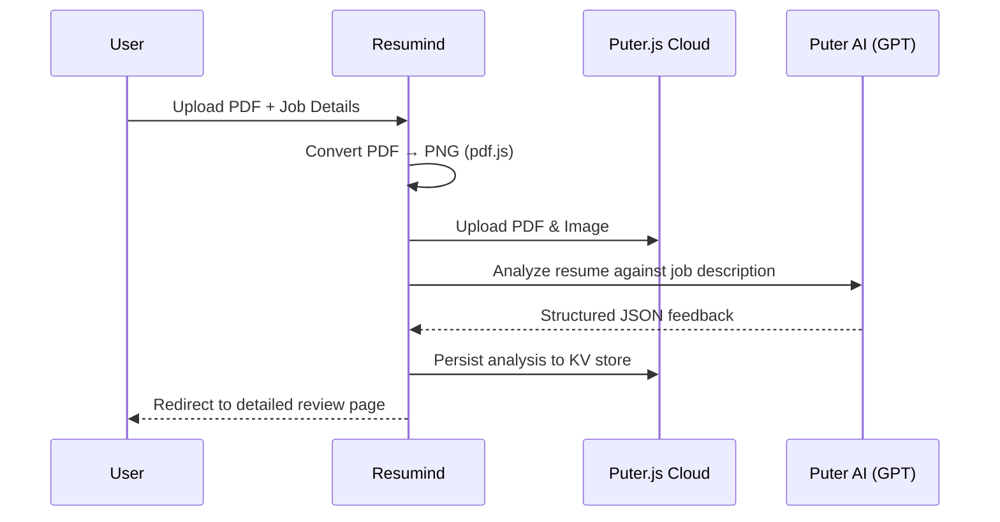

<p align="center">
  
</p>

<h1 align="center">Resumind — AI-Powered Resume Analyzer</h1>

<p align="center">
  <strong>Get instant, actionable feedback on your resume powered by AI.</strong><br/>
  Upload a resume, target a specific role, and receive detailed ATS compatibility scores with improvement suggestions.
</p>

<p align="center">
  
  
  
  
  
  
  
  
</p>

---

## ✨ Features

| Feature                        | Description                                                                            |
| ------------------------------ | -------------------------------------------------------------------------------------- |
| **📄 Resume Upload**           | Drag-and-drop or click-to-upload PDF resumes with real-time upload progress            |
| **🤖 AI-Powered Analysis**     | Leverages Puter.js AI to analyze resumes against job descriptions                      |
| **📊 ATS Scoring**             | Numerical ATS compatibility score out of 100 with visual indicators                    |
| **🎯 Multi-Category Feedback** | Detailed scores across **5 categories**: ATS, Tone & Style, Content, Structure, Skills |
| **💡 Actionable Tips**         | Each category provides "Good" vs "Needs Improvement" tips with explanations            |
| **🖼️ Resume Preview**          | PDF → high-quality PNG conversion for instant visual preview                           |
| **📈 Score Visualization**     | Custom SVG gauge and circular score components with gradient animations                |
| **🔐 Authentication**          | Secure sign-in via Puter.js OAuth with protected routes                                |
| **☁️ Cloud Storage**           | All resumes, images, and analysis data persisted in Puter.js cloud                     |
| **📋 Resume Dashboard**        | Homepage tracks all analyzed resumes with score previews                               |
| **🐳 Docker Support**          | Multi-stage Dockerfile for optimized production builds                                 |

---

## 🏗️ Architecture

```
app/
├── Components/
│   ├── ATS.tsx              # ATS score card with color-coded indicators
│   ├── Accordion.tsx        # Reusable accordion for expandable sections
│   ├── Details.tsx          # Detailed category-by-category feedback view
│   ├── FileUploader.tsx     # Drag-and-drop PDF uploader (react-dropzone)
│   ├── NavBar.tsx           # Global navigation bar
│   ├── ResumeCard.tsx       # Resume preview card for the dashboard
│   ├── ScoreGauge.tsx       # SVG semi-circular gauge with gradient fill
│   ├── Summary.tsx          # Overall score summary with category breakdown
│   └── scoreCircle.tsx      # Circular score indicator
├── lib/
│   ├── pdf2image.ts         # PDF → PNG conversion using pdf.js
│   ├── puter.ts             # Zustand store wrapping Puter.js SDK
│   └── utils.ts             # UUID generation & utility helpers
├── routes/
│   ├── auth.tsx             # Authentication page
│   ├── home.tsx             # Dashboard — lists all analyzed resumes
│   ├── resume.tsx           # Detailed resume review with feedback
│   └── upload.tsx           # Upload flow: form → AI analysis → redirect
├── routes.ts                # Route definitions
└── root.tsx                 # App shell with Puter.js initialization
```

---

## 🛠️ Tech Stack

| Layer                | Technology                      | Purpose                                            |
| -------------------- | ------------------------------- | -------------------------------------------------- |
| **Framework**        | React 19 + React Router 7       | SPA with file-based routing                        |
| **Language**         | TypeScript 5.9                  | Type-safe development                              |
| **Styling**          | Tailwind CSS 4 + tw-animate-css | Utility-first styling with animations              |
| **State Management** | Zustand 5                       | Lightweight global state for auth, file system, AI |
| **Build Tool**       | Vite 7                          | Lightning-fast HMR and builds                      |
| **AI Backend**       | Puter.js AI                     | GPT-powered resume analysis (no API keys needed)   |
| **Cloud Storage**    | Puter.js FS + KV                | File storage and key-value persistence             |
| **Auth**             | Puter.js Auth                   | OAuth-based user authentication                    |
| **PDF Processing**   | pdf.js (pdfjs-dist)             | Client-side PDF rendering and image conversion     |
| **File Upload**      | react-dropzone                  | Drag-and-drop file upload UI                       |
| **Containerization** | Docker (multi-stage)            | Optimized production images with Node 20 Alpine    |

---

## 🚀 Getting Started

### Prerequisites

- **Node.js** ≥ 18
- **npm** ≥ 9

### Installation

```bash
# Clone the repository
git clone https://github.com/jatinverma2705/AI-powered-ATS.git
cd AI-powered-ATS

# Install dependencies
npm install

# Start the dev server
npm run dev
```

The app will be available at `http://localhost:5173`.

### Docker

```bash
# Build the image
docker build -t resumind .

# Run the container
docker run -p 3000:3000 resumind
```

---

## 📖 How It Works



1. **Upload** — User submits a PDF resume along with the target company, job title, and job description
2. **Process** — The app converts the first page of the PDF to a high-resolution PNG thumbnail using pdf.js (4x scale, maximum quality)
3. **Store** — Both the original PDF and generated image are uploaded to Puter.js cloud storage
4. **Analyze** — The resume is sent to Puter's AI with a detailed prompt instructing it to evaluate ATS compatibility, tone, content, structure, and skills
5. **Display** — Results are presented with animated score gauges, color-coded badges (Strong / Good Start / Needs Work), and expandable accordion sections with actionable tips

---

## 📊 Scoring Categories

| Category         | What It Evaluates                                                  |
| ---------------- | ------------------------------------------------------------------ |
| **ATS Score**    | How well the resume passes through Applicant Tracking Systems      |
| **Tone & Style** | Writing quality, professionalism, and consistency                  |
| **Content**      | Relevance and impact of experience, achievements, and descriptions |
| **Structure**    | Layout, organization, section ordering, and scannability           |
| **Skills**       | Technical and soft skills alignment with the target role           |

Each category produces:

- A **numerical score** out of 100
- A **color-coded badge** (🟢 Strong > 69 | 🟡 Good Start > 49 | 🔴 Needs Work ≤ 49)
- **3–4 actionable tips** labeled as ✅ Good or ⚠️ Improve, each with a detailed explanation

---

## 📜 Available Scripts

| Command             | Description                       |
| ------------------- | --------------------------------- |
| `npm run dev`       | Start development server with HMR |
| `npm run build`     | Build for production              |
| `npm run start`     | Serve the production build        |
| `npm run typecheck` | Run TypeScript type checking      |

---

## 🤝 Contributing

Contributions are welcome! Feel free to open an issue or submit a pull request.

1. Fork the repository
2. Create your feature branch (`git checkout -b feature/amazing-feature`)
3. Commit your changes (`git commit -m 'Add amazing feature'`)
4. Push to the branch (`git push origin feature/amazing-feature`)
5. Open a Pull Request

---

## 📄 License

This project is open source and available under the [MIT License](LICENSE).
